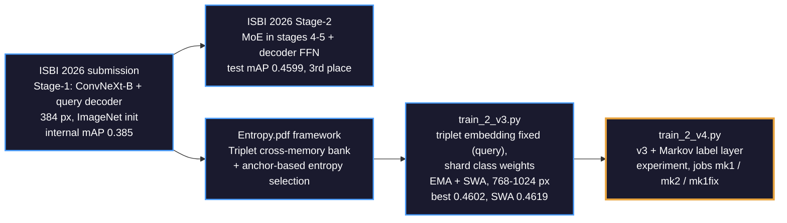
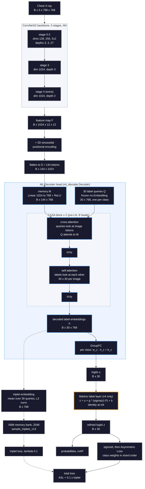
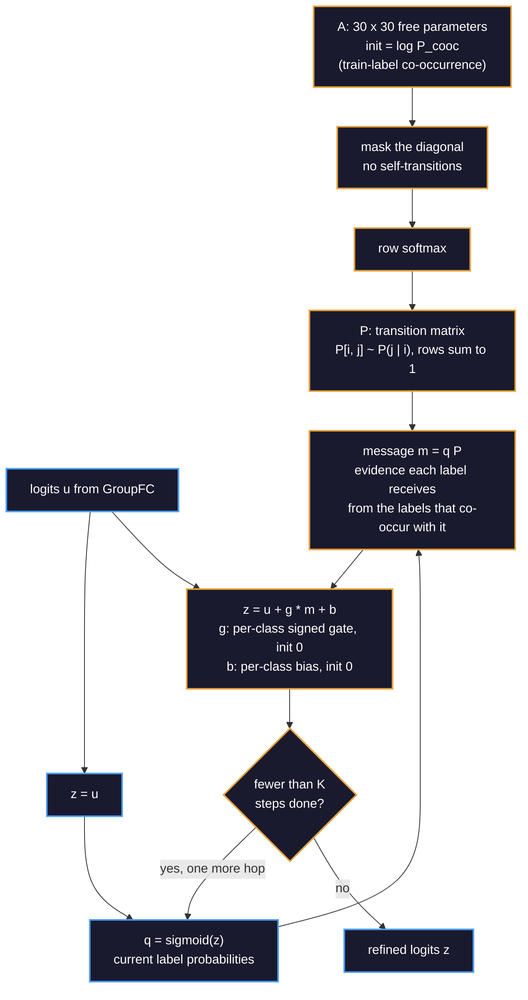
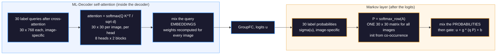
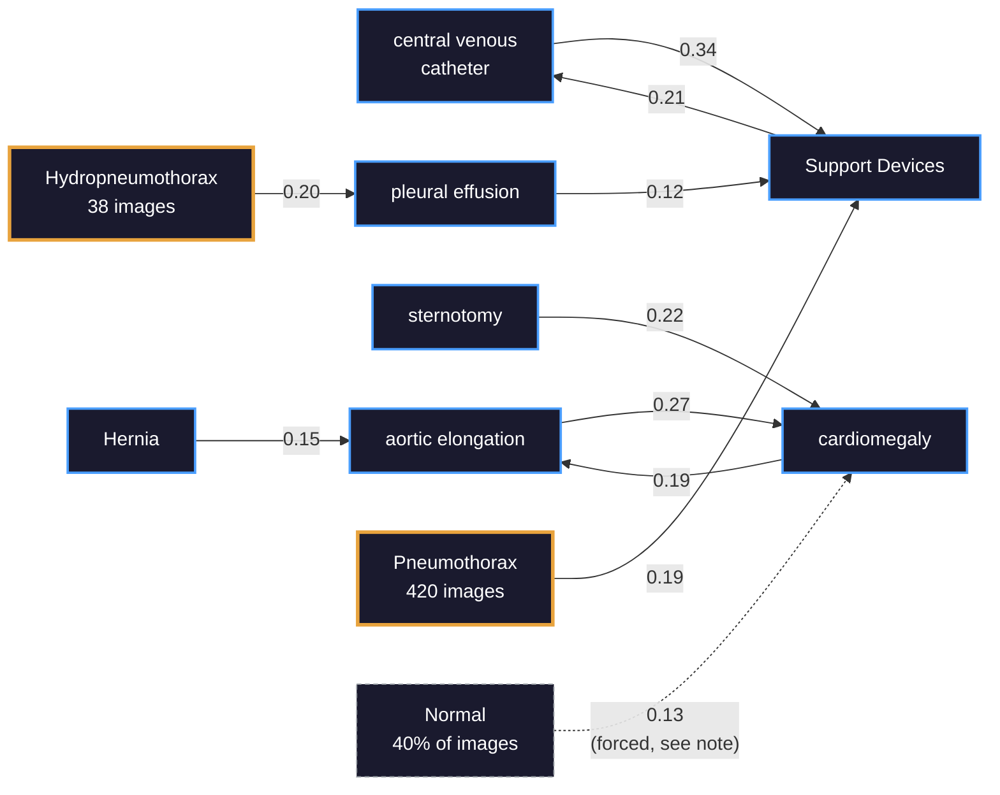

# The Markov label layer in our Stage-2 model — and how it relates to the ML-Decoder

*2026-09-26 · Stage-2 v4 (`train/train_2_v4.py`, `train/markov_layer.py`). Background:
[`docs/ISBI2026.pdf`](ISBI2026.pdf), [`docs/Entropy.pdf`](Entropy.pdf),
[`result/2026-09-26-markov-applicability.md`](result/2026-09-26-markov-applicability.md).*

**TL;DR**

- The Markov layer is a small head **after** the ML-Decoder logits. It passes the predicted label
  probabilities through a 30×30 label-transition matrix `P`, initialised from training co-occurrence
  and trainable. It adds the result back to the logits through a per-class gate that starts at zero,
  so the model **starts exactly as the v3 baseline**.
- The ML-Decoder already does something similar. Its query **self-attention** is a row-stochastic 30×30
  mixing over the label queries. That mixing is *recomputed for every image* and works in the 768-d
  embedding space. The Markov layer adds **one global, interpretable** transition matrix in
  probability space.
- That overlap is why a *fixed* co-occurrence smoothing lowered mAP offline (−0.0006 to −0.0053). The
  trainable, identity-initialised version is being tested in jobs mk1 / mk2 / mk1fix against v3 job
  49000.

---

## 1. Lineage — where v4 comes from

Stage-2 initialises from the Stage-1 checkpoint `train/checkpoint3/Model_20260119_062652` and
fine-tunes the whole network. v4 changes only what
happens **after** the classifier logits.

## 2. Full forward pass (shapes at 768 px, batch B)

- At 1024 px the feature map is 16×16, so there are S = 256 image tokens. Everything after the
  decoder keeps the same shape.
- Following ISBI2026.pdf §2.2, each block applies **cross-attention first** ("let these queries
  interact with the visual tokens via cross-attention first") and **then self-attention among the
  label queries**. That second step is where the decoder already models label co-occurrence.
- The triplet branch (dashed) reads `h` through `Decoder.last_h`. It shapes the embedding space only
  and never touches the logits, so it is unaffected by the Markov layer.

## 3. Inside the Markov layer

$$
P=\operatorname{softmax}_{\text{row}}\!\big(A \odot (1-I) - \infty\cdot I\big),\qquad
z^{(0)}=u,\qquad
z^{(k)} = u + g\odot\big(\sigma(z^{(k-1)})\,P\big) + b,\quad k=1..K
$$

- **Identity at initialisation.** With `g = b = 0`, `z = u`, so v4 starts exactly at the v3 model.
  The layer can only contribute what training finds useful. The gradient initially reaches only
  `g` (∂L/∂A ∝ g = 0), so `P` starts adapting once the gates move.
- **A true Markov matrix throughout training.** `P` is a row-softmax, so every row stays a
  probability distribution over "next" labels.
- **Signed gate.** A negative `g_j` lets co-occurring evidence *suppress* label j. That is the only
  way the layer can express exclusivity (see §5).
- **Separate optimiser group.** `A`, `g` and `b` train at 10× the base LR with no weight decay,
  because they start from zero. `--markov-fixed-transition` freezes `A` at the co-occurrence init.
- **Arms:** K = 1 (`mk1`), K = 2 (`mk2`), and K = 1 with `P` frozen (`mk1fix`).

## 4. ML-Decoder self-attention vs the Markov layer

Both are *row-stochastic 30×30 mixings over the labels*. They differ in where they act and in what
decides the weights.

| | ML-Decoder self-attention | Markov label layer |
|---|---|---|
| Where it acts | inside each decoder block, after cross-attention | after `GroupFC`, on the logits |
| Space | 768-d label-query embeddings | 30 label probabilities |
| Mixing matrix | `softmax(QKᵀ/√d)`, 30×30, row-stochastic | `P = softmax_row(A)`, 30×30, row-stochastic |
| Depends on the image? | **Yes**: recomputed for every image | **No**: one global matrix (its *input* `q` is image-specific) |
| How many | 8 heads × 2 blocks = 16 mixings | 1 matrix, applied K = 1 or 2 times |
| Initialisation | random projections, learned in Stage-1 | empirical co-occurrence P(j given i) |
| Interpretable? | Not directly (per-image, per-head attention maps) | Yes: `P[i, j]` reads as "given label i, how likely label j" |
| Can it express "A excludes B"? | Implicitly, through the learned embeddings | Not in `P` (all entries ≥ 0, rows sum to 1); **only via a negative gate** |
| Parameters | about 2 × 2.4 M for the attention projections | 30×30 + 30 + 30 = 960 |

**Takeaway.** The decoder already performs **image-conditioned** label-to-label message passing,
which is a Markov-like transition that changes per image. A fixed global `P` on top adds little new
information and blurs each image's own evidence. That is what the offline test showed (fixed smoothing:
−0.0006 to −0.0053 mAP; the winner's normal-gating: −0.024). The v4 layer is therefore trainable and
starts as the identity, and the experiment asks whether *any* global label prior helps once the
gates are free to learn it.

## 5. The label Markov chain in our training data

These are the strongest transitions in the initial `P`, built from label co-occurrence in
`train/CXRLT_2026_training_filtered.csv` (the file `train_2_v4.py` reads), N = 103,303 images. Edge label = `P(target | source)`. Rare (tail) classes are shown in amber.

- **Tail diseases lean on head diseases.** This is challenge 1 in Entropy.pdf (slide 3): *"the tail
  disease often co-exist with head diseases"*. Hydropneumothorax (38 training images) mostly
  transitions to pleural effusion, and Pneumothorax to Support Devices. A global prior can pass head
  evidence to a tail class. It can equally produce false tail positives on every effusion
  case. That trade-off is what the gate `g` learns to balance.
- **Row normalisation forces Normal to transition somewhere.** Normal appears together with a finding
  in only 152 training images. Even so, its row in `P` must sum to 1, so it still "points" to
  cardiomegaly (0.13), Support Devices (0.10), and so on. `P` has no way to say "Normal excludes
  every finding". Only a negative gate on the finding classes can express that.

## 6. Training and evaluation flow for v4

```mermaid
flowchart LR
    SUB["scripts/submit_stage2_v4_markov.sh<br/>768 px, seed 42, dp 0.1<br/>4 of 8 cosine epochs, SWA 3"] --> JOB["scripts/train_2_v4.sh<br/>Slurm job"]
    JOB --> TR["train/train_2_v4.py<br/>ConvNeXt2Markov<br/>Stage-1 init, layer = identity"]
    TR --> OPT["AdamW groups<br/>model: lr 1e-4, wd 1e-2<br/>markov: lr 1e-3, wd 0"]
    OPT --> EMA["EMA weights<br/>evaluated each epoch"]
    EMA --> CK["model_best.pth<br/>model_swa.pth<br/>include label_refine.*"]
    TR -. "per epoch: gate magnitude" .-> MON["scripts/mon.py --mk<br/>MARKOV column, delta vs job 49000"]
    CK --> EV["evaluate/evaluate_tta_v4.py<br/>detects the layer in the checkpoint"]
    EV --> PR["dumped probabilities"]
    PR --> SUBS["analysis/markov_check.py<br/>val_subsets(): all / frontal /<br/>frontal and unseen-patient"]
    CK -. "do NOT use" .-> OLD["evaluate/evaluate_tta.py<br/>would drop label_refine.*"]

    classDef mk fill:#1a1a2e,stroke:#e8a33d,stroke-width:2px,color:#fff
    classDef base fill:#1a1a2e,stroke:#4a9eff,stroke-width:2px,color:#fff
    classDef warn fill:#1a1a2e,stroke:#ff5c5c,stroke-width:2px,stroke-dasharray:4 3,color:#fff
    class SUB,JOB,TR,OPT,CK,EV mk
    class EMA,MON,PR,SUBS base
    class OLD warn
```

`train_2_v3.py`, `convnext.py` and `evaluate_tta.py` are untouched, so existing checkpoints and runs
are unaffected. With `--markov-steps 0`, v4 is identical to v3.

## 7. The experiment

Every arm uses the push-wave recipe at 768 px, seed 42 (drop-path 0.1, 4 of 8 cosine epochs, SWA of 3
EMA epochs, triplet λ = 0.1). Each is matched to v3 job **49000**: best 0.4585 @ epoch 3, SWA 0.4600,
flip-TTA 0.4650, frontal & unseen-patient 0.4706.

| Arm | Markov steps K | `P` | Status (2026-09-26) |
|---|---|---|---|
| mk1 | 1 | learnable | smoke 49053 queued (per-user memory cap) |
| mk2 | 2 | learnable | smoke 49054 queued |
| mk1fix | 1 | frozen at co-occurrence | smoke 49055 queued |

**What to watch:**
- `|g|` in `mon.py --mk`: near 0 means training chose not to use the layer.
- Δ best / Δ SWA versus 49000.
- The frontal & unseen-patient subset, the closest local proxy for the leaderboard.
- Per-class AP on tail classes: does the prior help them, or create false positives?

## 8. Code map

| What | Where |
|---|---|
| Backbone `ConvNeXt2`, 5 stages /64 | `train/convnext.py:369` |
| Decoder head construction (30 queries, 2 blocks, GELU) | `train/convnext.py:436` |
| 2D positional encoding | `train/convnext.py:445` |
| `ConvNeXt2.forward` returns (logits, memory) | `train/convnext.py:475` |
| `Decoder` (ML-Decoder head) | `train/ml_decoder.py:301` |
| Memory projection `embed_standart` | `train/ml_decoder.py:321` |
| Frozen label queries | `train/ml_decoder.py:325` |
| CA → FFN → SA → FFN block | `train/ml_decoder.py:208` |
| `last_h` exposed for the triplet embedding | `train/ml_decoder.py:394` |
| `GroupFC` per-class output | `train/ml_decoder.py:86` |
| Co-occurrence transition init | `train/markov_layer.py:35` |
| `MarkovLabelRefiner` / `transition()` / `forward()` | `train/markov_layer.py:43` / `:60` / `:64` |
| `ConvNeXt2Markov` | `train/markov_layer.py:84` |
| Checkpoint-aware loader | `train/markov_layer.py:99` |
| v4 `create_model` | `train/train_2_v4.py:442` |
| Markov optimiser group | `train/train_2_v4.py:701` |
| Triplet embedding / mining / total loss | `train/train_2_v4.py:866` / `:871` / `:888` |
| Per-epoch gate log | `train/train_2_v4.py:1012` |
| `--markov-steps` CLI | `train/train_2_v4.py:1200` |
| `P` built from training labels | `train/train_2_v4.py:1436` |
| v4 evaluation wrapper | `evaluate/evaluate_tta_v4.py:18` |
| Offline checks (smoothing, normal-gating, subsets) | `analysis/markov_check.py:68` / `:114` / `:188` |

## Sources

- `docs/ISBI2026.pdf`: §2.2 model architecture (query decoder replacing global average pooling;
  cross-attention before self-attention); §2.4–2.5 two-stage training, MoE, ASL; Table 3 (test mAP 0.4599).
- `docs/Entropy.pdf`: slide 3 (challenges: label co-occurrence, imbalance); slides 5–7 (triplet
  cross-memory bank, anchor-based entropy selection); slide 9 (384 vs 512 px internal results).
- `docs/result/2026-09-26-markov-applicability.md`: offline smoothing and normal-gating results;
  CXR-LT 2026 test-set facts.
