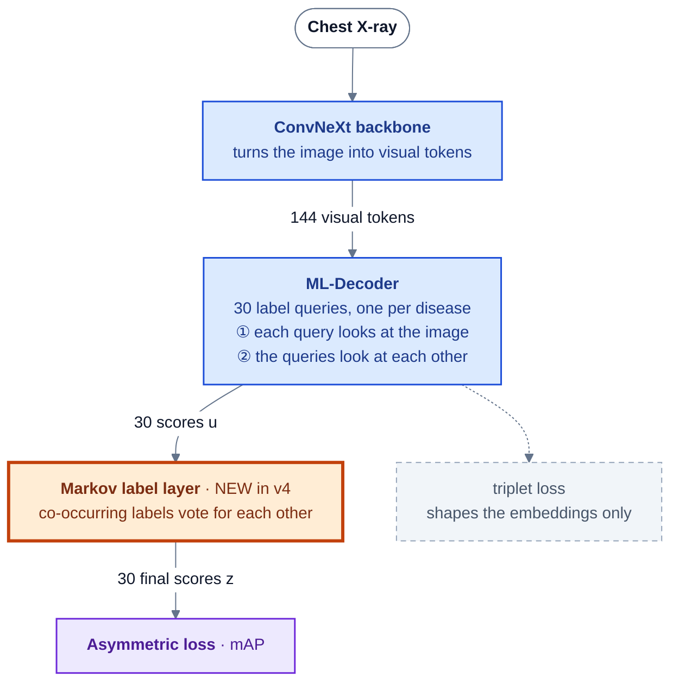

# Markov chains / HMMs for CXR-LT Task 1 — applicability check — 2026-09-26

**Question:** does the Markov-chain / hidden-Markov-model technique help this project
(30-class multi-label classification of single PadChest images, macro mAP)?
**Architecture diagrams** (where the Markov layer sits and how it relates to the ML-Decoder):
[`docs/markov-layer-architecture.md`](../markov-layer-architecture.md).
**Reproduce:** `python analysis/markov_check.py` (CPU, a few minutes; prints every local number
below). Online sources are listed at the end.

**Where the Markov step sits** (colour key: 🟦 existing v3 network, 🟧 new Markov layer,
⬜ data, 🟪 loss, dashed = triplet branch):

Section (A) below tests a *fixed*, post-hoc version of the orange step on saved probabilities. The
v4 layer is the *trainable* version; its internals are in the architecture doc (§3).

A Markov model needs a sequence of states. This project has two candidate sequences:
**(A)** the label graph (co-occurrence as transition probabilities), and **(B)** a patient's
studies over time (disease state at study *t* depends on study *t−1*; an HMM treats the true
disease state as hidden and the image as a noisy emission of it).

## Verdict

| Idea | Verdict | Evidence |
|---|---|---|
| (A) Random-walk smoothing over the label co-occurrence graph | **Drop** — hurts at every strength | −0.0006 to −0.0053 mAP on the current best ensemble |
| (A′) Label-order models (classifier chains, CNN-RNN decoders) and label GCNs | **Drop** | Need an arbitrary label order or add a graph that ML-Decoder's label queries already cover. CheXGCN-style papers report modest AUC gains on NIH/CheXpert; no top CXR-LT 2024/2026 solution used them |
| (A″) Normal-gating: the Task 1 winner's exclusivity prior, p_c ← p_c·(1−p_Normal)^0.5 | **Drop for our model** | −0.010 to −0.046 mAP; 28 of 30 classes get worse |
| (B) Longitudinal Markov / HMM over a patient's studies | **Drop** (was "park") | The test set is patient- and study-de-duplicated against training, patient IDs are not released, and re-identification is forbidden (quotes below) |
| MCMC sampling | Not relevant | No posterior sampling problem in this pipeline |

**Bottom line:** Markov-style modeling has no path to leaderboard mAP here. The research did turn
up something more useful: our internal val is a poor stand-in for the leaderboard, and a
frontal-only, patient-disjoint subset is a better proxy (see *Val vs leaderboard*).

## (A) Label-graph Markov smoothing — tested offline

**Method.** Build the transition matrix P from train-fold (`data/train_fold_1.csv`) label
co-occurrence: `P[i,j] = P(j | i)`, diagonal removed, rows renormalized (row-stochastic).
The classes are in shard/logit order, from `/data/psytp7/wds_shards_train_raw/label_info.pt`.
Blend each image's predicted probabilities with one random-walk step,
`q = (1−α)·p + α·(p̂ P)·Σp`, where `p̂ = p / Σp`. Scored on the cached flip-TTA probabilities of
the current best greedy-3 ensemble (`analysis/out/probs_w01_flip/`: img768_s42 SWA +
img1024_s86 SWA + img640_s86), using the same `macro_map` as `analysis/ens_select.py`.
n_val = 17,270.

| α | mAP | Δ vs base |
|---|---|---|
| 0 (base) | 0.4722 | — |
| 0.02 | 0.4716 | −0.0006 |
| 0.05 | 0.4710 | −0.0012 |
| 0.10 | 0.4698 | −0.0024 |
| 0.20 | 0.4669 | −0.0053 |

At α = 0.05 the loss is concentrated in the head classes (mean ΔAP over the 10 most frequent
classes −0.0021; over the 10 rarest −0.0001).

**Why it fails.** AP is a per-class *ranking* metric. Smoothing moves probability mass from an
image's confident classes to classes that co-occur with them *on average*. That blurs exactly the
per-image evidence the ranking depends on. The ML-Decoder head already learns label interactions
through its label queries, so a fixed co-occurrence prior adds no new information.

## (A″) Normal-gating — the Task 1 winner's label-structure prior

The CXR-LT 2026 Task 1 winner (CVMAIL × MIHL, test mAP 0.585) applies *"For each abnormal class
c≠0, we suppress its score by p_c ← p_c·(1−p_0)^α_ng, where α_ng=0.5"*, where p_0 is the Normal
probability. This is a hard-exclusivity prior: in our val labels, Normal co-occurs with an
abnormal finding in only 26 of 17,270 images. It is the one label-structure trick with a
published win, so we tested it on the same cached ensemble:

| Variant | mAP | Δ |
|---|---|---|
| base | 0.4722 | — |
| gate α = 0.25 | 0.4619 | −0.0103 |
| gate α = 0.5 (winner's setting) | 0.4483 | −0.0239 |
| gate α = 1.0 | 0.4264 | −0.0459 |
| reverse gate, p_Normal·(1−max abnormal)^0.5 | 0.4722 | ±0.0000 |

The single img1024 model behaves the same way (−0.024 at α = 0.5). The likely reason is that
the winner trained with a Distribution-Balanced loss plus class-aware sampling. Both push
abnormal scores up, so they needed the gate to *"suppress spurious abnormal predictions"*. Our
ASL-trained model has no such bias, so the gate only mixes errors in p_Normal into every other
class's ranking. Caveat: this was measured on report-derived internal labels. The leaderboard
uses radiologist labels.

## (B) Longitudinal Markov / HMM — closed by the challenge design

Locally the structure exists (original PadChest metadata,
`/data/psytp7/PADCHEST_chest_x_ray_images_labels_160K_01.02.19.csv`, read with `dtype=str`):

| Fold | Patients | Patients with ≥2 studies | Images from those patients |
|---|---|---|---|
| train | 50,604 | 13,198 | 50.1% |
| val | 14,501 | 1,548 | 21.6% |

The ImageID prefix equals the StudyID in 98.8% of rows, so a test image *could* technically be
linked to its patient through the public PadChest CSV. The challenge closes this route. From the
CXR-LT 2026 challenge paper (arXiv 2604.15555, pp. 4–5):

- *"Because PadChest-GR is derived from PadChest, we performed both patient-level and study-level
  de-duplication to prevent leakage"*. Test patients have no history in the training set.
- *"Patient identifiers and hidden evaluation labels were not released to participants."*
- Participants must follow *"the applicable data-use restrictions, including research-only use,
  no redistribution, and no attempts to re-identify individual patients."*

So a patient-history prior has nothing to condition on at test time, and building one through
metadata linkage would break the data-use terms. The idea only makes sense for a clinical
deployment study with real prior studies. That is the setting of the temporal-VLP literature
(BioViL-T / MS-CXR-T, CheXTemporal), which targets progression labels (improving / stable /
worsening), not Task 1's static findings.

## Val vs leaderboard: how far our internal val is from the test set

Found while checking (B), then quantified. **The Task 1 test set** (challenge paper): 3,020
**frontal** PadChest-GR images (1,620 dev / 1,400 test), *"that contain at least one target
disease finding"*, **radiologist-annotated**, and patient-de-duplicated against training.
**Our internal val** (`data/val_fold_1.csv`):

- **Not patient-disjoint.** It shares 10,978 patients with `data/train_fold_1.csv`, and
  **77.0% of val images** belong to a patient who is also in train. `/data/psytp7/generate_folds.py`
  splits by patient but did *not* produce these files: they have an `Unnamed: 0` index column,
  ~120k rows and a ~14% val fraction.
- **~30% lateral views** (L 5,234 of 17,270 scored images); the test set is frontal only.
- **Report-derived labels**, versus radiologist labels on the test set.
- Also: `train/CXRLT_2026_training_filtered.csv` stores `PatientID` as a float (`3.24e+38`),
  which merges patients. Use the PadChest CSV with `dtype=str` for any patient grouping.

**Subset scores.** The dumped probabilities have no sample keys, so their row order was rebuilt:
2 val shards → DataLoader workers 0 and 1, batches of 8 alternating. The rebuilt order
(`analysis/out/val_key_order.npy`) reproduces all 17,270 rows of `labels.npy` exactly, and only
one arrangement of the 4 missing CSV rows fits. Macro mAP over classes with ≥1 positive in each
subset (the frontal & unseen subset has 28 such classes):

| Model (flip TTA) | all (17,270) | frontal (11,973) | lateral (5,234) | frontal & seen-patient (8,401) | **frontal & unseen-patient (3,572)** |
|---|---|---|---|---|---|
| greedy-3 ensemble | 0.4722 | **0.4968** | 0.4058 | 0.5025 | **0.4752** |
| push img1024 SWA | 0.4645 | 0.4892 | 0.3954 | 0.4930 | 0.4719 |
| push img768_s42 SWA | 0.4650 | 0.4875 | 0.3988 | 0.4945 | 0.4706 |
| push img896 SWA | 0.4578 | 0.4804 | 0.3927 | 0.4838 | 0.4702 |
| res_sweep img768_s86 | 0.4570 | 0.4785 | 0.3894 | 0.4837 | 0.4642 |
| res_sweep img640_s86 | 0.4485 | 0.4717 | 0.3918 | 0.4801 | 0.4514 |
| seedsweep 512 s1024 | 0.4480 | 0.4697 | 0.3873 | 0.4750 | 0.4649 |
| sweep2 512 dp01 s86 | 0.4429 | 0.4641 | 0.3838 | 0.4694 | 0.4644 |

Patient-clustered bootstrap (300 resamples) for img1024 SWA minus 512 seed1024:
- frontal & seen: **+0.0196 [+0.0047, +0.0358]**;
- frontal & unseen: **+0.0074 [−0.0200, +0.0269]**.

What this shows:

1. **Lateral views depress the headline number.** On frontal images, the view the test set
   uses, the current ensemble is already at 0.4968. Measured on that population, the
   "0.49 target" has effectively been reached. The full-val 0.4722 mixes in laterals at 0.4058.
2. **The resolution gain is mostly unproven on unseen patients.** 1024-vs-512 is +0.020 (CI
   excludes 0) on seen patients but +0.007 (CI includes 0) on unseen ones. The ordering
   push-wave > 768/640 > 512 holds loosely on unseen patients, but the gaps are within noise.
   img640 even falls below 512.
3. **The seen/unseen gap (0.5025 vs 0.4752) is not all memorization.** Unseen patients have a
   different case mix: Normal prevalence 0.58 vs 0.35, 1.27 vs 1.57 labels per image, and 90% vs
   63% frontal. Only a patient-disjoint re-split with matched case mix can separate the two.
4. This fits the known internal→leaderboard offset (Stage-1: 0.385 internal → 0.505 dev). The
   test set is frontal only and every image has at least one finding.

## What the published CXR-LT winners did instead

None of the top CXR-LT 2024 or 2026 Task 1 solutions used Markov, label-graph or patient-history
modeling. What they used:

| Challenge | Team | Key ingredients | Task 1 mAP |
|---|---|---|---|
| 2026 | Winner, CVMAIL × MIHL | ConvNeXtV2-B **pretrained on MIMIC-CXR**, 512 px, Distribution-Balanced loss (effective-number reweighting + positive logit margin), class-aware sampling, normal-gating, weighted checkpoint ensemble, TTA | 0.585 (test) |
| 2026 | 2nd | ConvNeXtV2 + SwinV2-T, 512 px, PCAM pretraining, strong augmentation, ensemble, TTA | 0.483 |
| 2026 | 3rd | ConvNeXt, 384 px, ASL + auxiliary loss, MoE, ImageNet, TTA (appears to be our earlier MoE Stage-2 submission) | 0.460 |
| 2024 | several | CXR-domain pretraining (e.g. DINOv2 ViT-L on 710k CXRs; NIH/CheXpert/VinDr), **ML-Decoder heads**, multi-view/multi-resolution ensembles (CheXFusion), synthetic tail data | — |

**Rules that matter** (challenge paper §2.7): *"models pretrained … on external CXR datasets that
do not overlap with the CXR-LT evaluation images, were allowed"*. Participants may not *"use
hidden test labels, manually relabel evaluation images, or use external annotations overlapping
with the CXR-LT evaluation sets."* So MIMIC-CXR pretraining is legitimate, and the winner used
it. **PadChest-GR's own labels (downloadable from BIMCV) must not be used for tuning**, because
they are the evaluation annotations.

## Recommendations (none executed — each changes what the campaign optimizes)

1. **Re-anchor internal evaluation on a leaderboard-like proxy:** a patient-disjoint,
   frontal-only val fold, ideally restricted to images with ≥1 finding like the test set. Start
   cheaply by reporting the frontal & unseen-patient subset above for every new checkpoint,
   using `analysis/markov_check.py`'s `val_subsets()`. Then build a proper patient-disjoint fold
   (the `generate_folds.py` approach on the same images) and rebuild the val shards with
   `convert_dataset.py`.
2. **Re-check the resolution conclusion on that proxy** before spending more GPU time on
   ≥896 px. Right now it isn't significant on unseen patients.
3. **The largest untried lever the winners had and we don't is CXR-domain pretraining.** Our
   Stage-1 starts from ImageNet (1k, and 22k for the running 768 px retrain). A MIMIC-CXR (or
   multi-dataset) pretrained ConvNeXt initialization is the most direct path to the 0.585 winner.
   It needs credentialed PhysioNet access.
4. **Drop all Markov/HMM variants for Task 1.**

## Sources

- CXR-LT 2026 challenge paper: [arXiv 2604.15555](https://arxiv.org/abs/2604.15555) ([PMC](https://pmc.ncbi.nlm.nih.gov/articles/PMC13317641/)). Quotes are from the extracted PDF text, pp. 4–5 and §2.7.
- CXR-LT 2026 overview: [arXiv 2602.22092](https://arxiv.org/html/2602.22092v1)
- Winning Task 1 method (normal-gating formula, DB loss, MIMIC-CXR pretraining): [arXiv 2602.13430](https://arxiv.org/html/2602.13430v2)
- CXR-LT 2024 overview (top solutions table): [arXiv 2506.07984](https://arxiv.org/pdf/2506.07984)
- PadChest-GR dataset (evaluation source; do not use its labels): [arXiv 2411.05085](https://arxiv.org/abs/2411.05085), [BIMCV](https://bimcv.cipf.es/bimcv-projects/padchest-gr/)
- CheXGCN, label co-occurrence GCN for CXR: [IEEE JBHI 2020](https://ieeexplore.ieee.org/document/8961143/)
- Temporal CXR modeling (BioViL-T / MS-CXR-T): [arXiv 2301.04558](https://arxiv.org/pdf/2301.04558); CheXTemporal: [arXiv 2605.11304](https://arxiv.org/html/2605.11304)
- Leakage from image-level splits (general evidence): [Inflation of test accuracy due to data leakage (OCT)](https://www.ncbi.nlm.nih.gov/pmc/articles/PMC9500039/)
