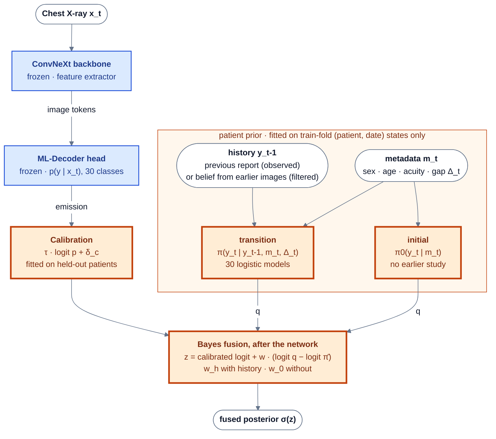
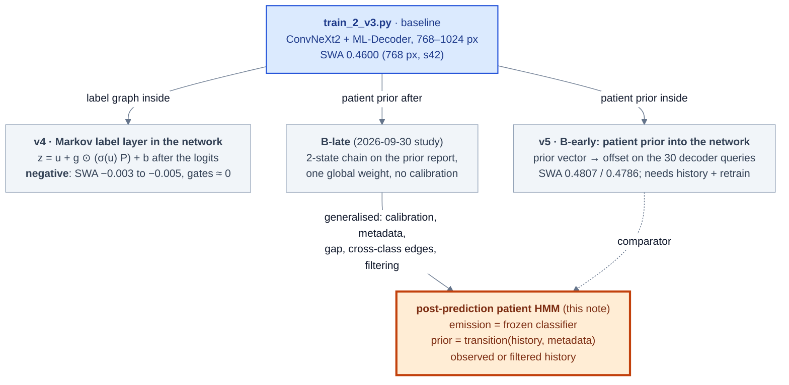
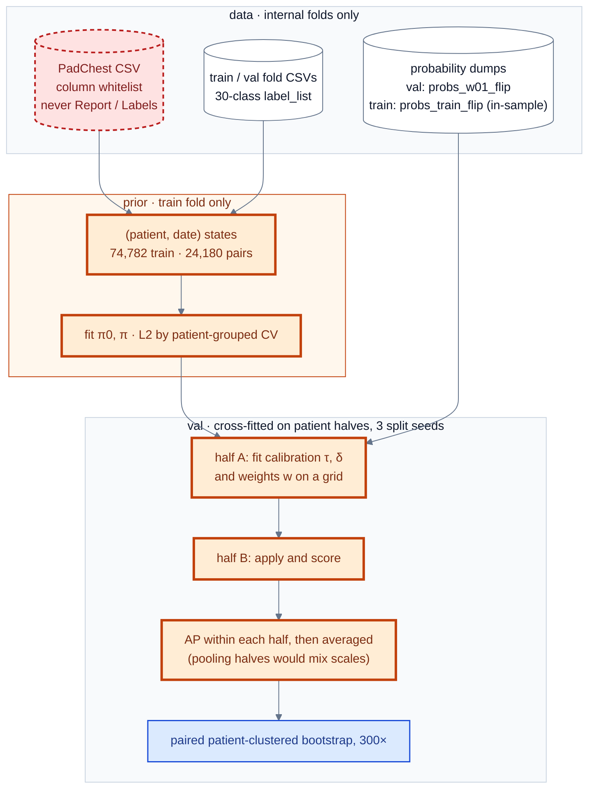
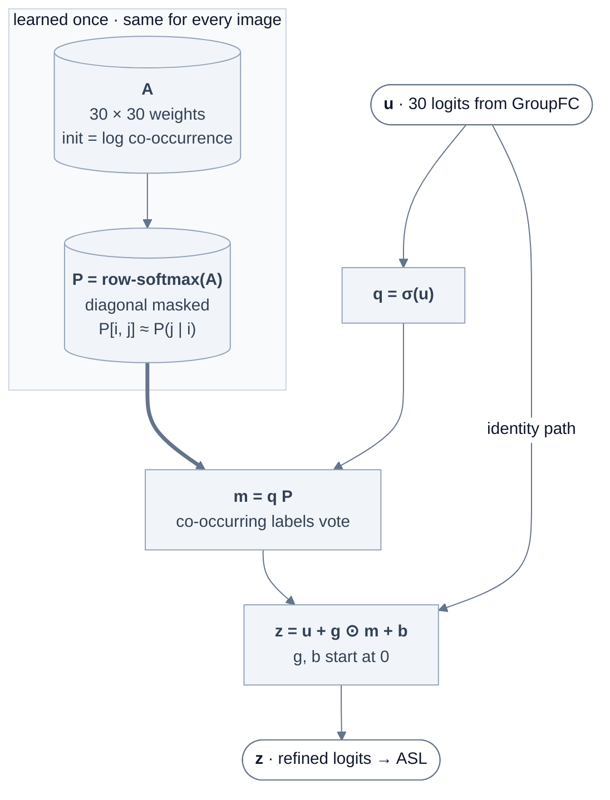

# The Markov layer, rebuilt: a post-prediction patient HMM

*2026-10-01. This note replaces the 2026-09-26 v4 note, which is now [Appendix A](#appendix-a--superseded-v4-in-network-markov-label-layer).
- Plans: [`2026-10-01-markov-hmm-redesign-plan.md`](2026-10-01-markov-hmm-redesign-plan.md) (design and arms) and
  [`2026-10-01-markov-hmm-docs-plan.md`](2026-10-01-markov-hmm-docs-plan.md) (this documentation).
- Results: [`2026-10-01-markov-hmm-posthoc.md`](2026-10-01-markov-hmm-posthoc.md) (HMM),
  [`2026-10-01-padchest-metadata-eda.md`](2026-10-01-padchest-metadata-eda.md) (metadata EDA),
  [`2026-10-01-markov-ab-verdict.md`](2026-10-01-markov-ab-verdict.md) (A vs B training comparison).
- Paper: `docs/paper/markov/paper.tex` §III-F, §IV, §V-D.
- Background: [`docs/pdf/ISBI2026.pdf`](../pdf/ISBI2026.pdf), [`docs/pdf/Entropy.pdf`](../pdf/Entropy.pdf).*

**TL;DR**

- **No Markov component sits before or inside ConvNeXt any more.**
  - The ConvNeXt backbone and its head are frozen and are used only as a feature extractor and classifier.
  - Their output probabilities p(y | x) are the **emission** of a hidden Markov model over a patient's studies.
  - The patient's history and metadata (sex, age, acuity, time gap) enter only through the **prior**: an initial distribution P(Y_1 | m) and a transition P(Y_t | Y_{t-1}, m_t, Δ_t).
  - The two are combined after the network by a weighted Bayes update.
- **The previous state comes from one of two sources:**
  - **observed mode:** the previous study's report labels, which a reading radiologist has;
  - **filtered mode:** a forward pass over the patient's earlier images alone.
- **"ConvNeXt + MoE":** our current Stage-2 head is the **ML-Decoder**. The MoE head belonged to the earlier ISBI 2026 Stage-2. The HMM takes any classifier's probability dump plus row keys, so an MoE checkpoint plugs in unchanged.
- **Results (internal val, clinical simulation)** — see [§4](#4-results):
  - The pre-specified primary arm H4 raises mAP on validation images with a prior study (frontal) by about +0.04, at both seeds.
  - That **matches B-early**, the alternative that feeds the prior into the network and needs a full retrain.
  - The simplest calibrated chain (H1) is best.
  - Most of the gain needs the prior *report*. The image-only filtered mode gains about +0.01.
- **Leaderboard effect: 0 by construction.** Test patients have no history, and the metadata are withheld ([§7](#7-scope)).

---

## 0. The big picture



- Blue boxes are the unchanged v3 network, and orange boxes are the new post-prediction model.
- The network is never retrained.
- With all fusion weights at 0, the output is the classifier's ranking, unchanged (asserted in code).

---

## 1. Lineage: where the post-prediction HMM comes from



| Design | Where the Markov step acts | Verdict | Write-up |
|---|---|---|---|
| Fixed label-graph smoothing | after a frozen model, label → label | −0.0006 to −0.0053 mAP | [`2026-09-26-markov-applicability.md`](2026-09-26-markov-applicability.md) |
| v4 Markov label layer (mk1 / mk2 / mk1fix / lr×100) | inside the network, after the logits, label → label | negative, gates ≈ 0 | [`../result/2026-09-27-v4-markov-result.md`](../result/2026-09-27-v4-markov-result.md), [`../result/2026-10-01-markov-ab-training.md`](../result/2026-10-01-markov-ab-training.md) |
| v5 B-early | inside the network (decoder queries), study → study | helps with history; needs a retrain | [`2026-10-01-markov-ab-verdict.md`](2026-10-01-markov-ab-verdict.md) |
| B-late | after a frozen model, study → study | helps with history; no retrain | [`2026-09-30-patient-markov-research.md`](2026-09-30-patient-markov-research.md) |
| **Post-prediction patient HMM** | **after a frozen model, study → study, with metadata** | **= B-early, no retrain** | [`2026-10-01-markov-hmm-posthoc.md`](2026-10-01-markov-hmm-posthoc.md) |

---

## 2. The model

### 2.1 Graphical model


- **State:** one per (patient, date). y_t ∈ {0,1}^30 is the OR of the labels of that day's studies, exactly as in `patient_prior.date_states`.
- **Joint distribution:** p(y_1:T, x_1:T) = p(y_1 | m_1) · Π_t>1 p(y_t | y_t-1, m_t) · Π_t p(x_t | y_t).

### 2.2 Equations (`analysis/markov_hmm.py`)

$$
\ell_c(x) = \tau\,\operatorname{logit} p_c(x) + \delta_c - \operatorname{logit}\bar\pi_c \qquad\text{(emission as a likelihood ratio; }\bar\pi = \text{train prevalence)}
$$

$$
\operatorname{logit}\pi^0_c(m) = \alpha^0_c + \gamma^{0\top}_c\phi(m),\qquad
\operatorname{logit}\pi_c(y', m, \Delta) = \alpha_c + \beta_c y'_c + \kappa_c y'_c g + \lambda_c g + \sum_{k\neq c} B_{ck} y'_k + \gamma_c^\top\phi(m)
$$

$$
z_c = \tau\,\operatorname{logit} p_c(x) + \delta_c + w\,\big[\operatorname{logit} q_c - \operatorname{logit}\bar\pi_c\big],\qquad
(q, w) = \begin{cases}(\pi(y_{t-1}, m_t, \Delta_t),\ w_h) & \text{earlier state}\\ (\pi^0(m_t),\ w_0) & \text{otherwise}\end{cases}
$$

- **Inputs to the prior:**
  - g = log(1 + gap days).
  - φ(m) = [sex = M, sex unknown, a restricted cubic spline of age (3 terms), acuity = AP, acuity = AP horizontal], standardised (`patient_meta.Featurizer`).
- **Fitting the prior:**
  - All 30 per-class logistic models are fitted at once as one batched float64 torch model, with L-BFGS and L2 (`fit_logistic`).
  - The penalties are chosen by patient-grouped 5-fold CV log-loss on train pairs.
  - The intercept and own-state terms are not penalised.
- **The weights:**
  - w = 1 is Bayes' rule.
  - w_h and w_0 are cross-fitted, because ASL probabilities are not calibrated posteriors and the image and the report share evidence (a device is visible *and* reported).

### 2.3 History modes

| Mode | Where y_t-1 comes from | Prediction step |
|---|---|---|
| **observed** | the previous state's report labels (0/1) | exact: q = π(y_t-1, m_t, Δ_t) |
| **filtered** | a factorised belief μ from a forward pass over all earlier states' images | q_c = μ_c σ(η_c(1, μ)) + (1 − μ_c) σ(η_c(0, μ)); then μ_t = σ(logit q + w_e · mean ℓ(images of date t)) |

- The filtered prediction is exact when B = 0; with cross-class edges it is mean-field (Boyen–Koller projection).
- **Check:** filtered mode with one-hot beliefs reproduces observed mode exactly (asserted).
- **Target date:** only the target image itself enters at the current date. Same-date sibling views are not fused, because that would be an unrelated multi-view gain.

### 2.4 Arms (pre-specified; the primary arm is H4)

| Arm | Adds |
|---|---|
| E | the emission only |
| H0 | pooled 2-state chain (a_c = P(1\|1), b_c = P(1\|0), Laplace), w_h = 1, no calibration. **Reproduces B-late exactly (asserted)** |
| H1 | + calibration + cross-fitted w_h |
| H2 | + gap terms κ, λ |
| H3 | + metadata φ in the transition and initial prior (w_0 then also moves rows without history) |
| **H4** | + cross-class temporal edges B (`B[k → c]`) |
| H5 | + within-state label–label MRF edges J (pseudo-likelihood Ising, damped mean field, weight w_J): an ablation |
| H4-acq | + per-state DICOM acquisition fields in φ (care-setting proxies): an ablation |
| H4-F | H4 in filtered mode |

---

## 3. Fitting and evaluation flow



- **Data rules** (`analysis/patient_meta.py`):
  - The CSV is read only through a column whitelist. The loader asserts that Report, Labels, Localizations, the CUIs and similar columns are never read.
  - Only fold images are joined. No dev/test image is ever joined.
  - Labels come only from the fold CSVs, in shard order.
  - PatientBirth and sex are allowed for the internal folds (user decision, 2026-10-01).
- **Leakage guard:** the prior parameters never see val labels. Val *history* uses train ∪ val studies, as in B-late and B-early, so the arms are comparable.
- **Estimator gotcha:** halves fitted with different calibrations must not be pooled into one ranking. Pooling once produced spurious losses of 0.006–0.03. The check is a recalibration-only arm, which must give Δ = 0.

---

## 4. Results

- **Source:** canonical run, job 49445 (`analysis/out/markov_hmm/run.log`, `results.json`).
- **Numbers:** Δ vs the emission E, as the patient-clustered bootstrap mean with 95% CI (300 resamples, split seed 0). Every mAP is computed within each patient half and averaged over 3 split seeds.
- **Subsets:** primary = val images with an earlier state that are frontal (n = 4,061); full = 17,270; no-prior = 11,511.
- **Point estimates:** H2 and H5 have no bootstrap.
- **Full write-up:** [`2026-10-01-markov-hmm-posthoc.md`](2026-10-01-markov-hmm-posthoc.md).

| Emission | Arm | full | **primary** | no-prior |
|---|---|---|---|---|
| **s42** | E (absolute mAP) | 0.4652 | 0.5020 | 0.4543 |
| | H0 | +0.009 [−0.003, +0.024] | +0.035 [+0.015, +0.058] | +0.000 [+0.000, +0.000] |
| | H1 | +0.022 [+0.014, +0.035] | +0.048 [+0.030, +0.066] | +0.000 [−0.000, +0.000] |
| | H2 | +0.020 (point) | +0.046 (point) | +0.000 (point) |
| | H3 | +0.016 [+0.009, +0.024] | +0.038 [+0.023, +0.052] | −0.001 [−0.002, −0.000] |
| | **H4** | +0.015 [+0.009, +0.023] | +0.038 [+0.023, +0.051] | −0.001 [−0.002, −0.000] |
| | H5 | +0.016 (point) | +0.039 (point) | −0.000 (point) |
| | H4-acq | +0.017 [+0.011, +0.025] | +0.038 [+0.023, +0.052] | −0.000 [−0.003, +0.002] |
| | H4-F | +0.003 [−0.002, +0.008] | +0.009 [−0.001, +0.018] | −0.001 [−0.002, −0.000] |
| | B-early | +0.019 [+0.013, +0.026] | +0.034 [+0.015, +0.055] | +0.001 [−0.005, +0.013] |
| | B-early0 | −0.003 [−0.009, +0.005] | −0.007 [−0.020, +0.001] | +0.001 [−0.005, +0.013] |
| **s1024** | E (absolute mAP) | 0.4635 | 0.4937 | 0.4551 |
| | H0 | +0.011 [−0.000, +0.027] | +0.043 [+0.022, +0.067] | +0.000 [+0.000, +0.000] |
| | H1 | +0.026 [+0.017, +0.040] | +0.053 [+0.035, +0.075] | +0.000 [−0.000, +0.000] |
| | H2 | +0.020 (point) | +0.052 (point) | +0.000 (point) |
| | H3 | +0.017 [+0.010, +0.025] | +0.043 [+0.029, +0.061] | −0.000 [−0.001, +0.001] |
| | **H4** | +0.016 [+0.009, +0.025] | +0.042 [+0.028, +0.059] | −0.000 [−0.001, +0.001] |
| | H5 | +0.017 (point) | +0.046 (point) | −0.000 (point) |
| | H4-acq | +0.018 [+0.012, +0.025] | +0.043 [+0.029, +0.060] | +0.001 [−0.002, +0.005] |
| | B-early | +0.019 [+0.011, +0.025] | +0.044 [+0.025, +0.063] | +0.000 [−0.006, +0.006] |
| | B-early0 | +0.000 [−0.004, +0.005] | −0.000 [−0.007, +0.009] | +0.000 [−0.006, +0.006] |
| **ens** | E (absolute mAP) | 0.4737 | 0.5100 | 0.4635 |
| | H0 | +0.003 [−0.008, +0.017] | +0.030 [+0.010, +0.052] | +0.000 [+0.000, +0.000] |
| | H1 | +0.020 [+0.012, +0.034] | +0.045 [+0.027, +0.063] | −0.000 [−0.000, +0.000] |
| | H2 | +0.019 (point) | +0.044 (point) | −0.000 (point) |
| | H3 | +0.015 [+0.009, +0.024] | +0.039 [+0.023, +0.056] | −0.000 [−0.000, +0.000] |
| | **H4** | +0.013 [+0.007, +0.022] | +0.036 [+0.021, +0.052] | −0.001 [−0.002, +0.000] |
| | H5 | +0.015 (point) | +0.039 (point) | −0.001 (point) |
| | H4-acq | +0.014 [+0.007, +0.023] | +0.036 [+0.021, +0.054] | +0.001 [−0.004, +0.004] |

**Decision rule (pre-specified):**
- **Win: met.**
  - H4 beats E on the primary subset at both seeds: +0.038 [+0.023, +0.051] (s42) and +0.042 [+0.028, +0.059] (s1024).
- **Matches B-early: met.** Paired H4 − B-early at the matched seed:

  | Subset | s42 | s1024 |
  |---|---|---|
  | primary | +0.002 [−0.016, +0.020] | −0.002 [−0.020, +0.016] |
  | full | −0.004 [−0.011, +0.005] | −0.002 [−0.010, +0.006] |

  The post-prediction model equals the network that was retrained with the prior, without touching the network.
- **Guards:**
  - No-prior rows: s42 is −0.0009 [−0.0018, −0.0001]. That is tiny, but the CI is just below 0, because w_0 = 0.25 was chosen in one fold. s1024 passes.
  - New-finding stratum AP ("new vs absent", 28 classes): it falls slightly at both seeds, 0.368 → 0.362 (s42) and 0.365 → 0.362 (s1024), with no CI.

**What the ladder says:**
- **Simplest is best.** H1 (pooled chain + calibration + fitted w_h ≈ 0.5–0.75) beats H4 by about 0.01 everywhere. The exploratory H1 − B-early on the primary subset is +0.012 [−0.008, +0.035] (s42) and +0.008 [−0.013, +0.029] (s1024).
- **A better prior does not mean a better fusion.** Gap, metadata and cross-class edges make the prior a much better *predictor* of the next study without the image. On held-out train pairs, the macro log-loss goes 0.151 → 0.145 → 0.138 → 0.137, and the macro AUROC 0.662 → 0.765 → 0.803 → 0.813. They still lower the fused mAP, because what they add (acuity → devices, age → aortic change) is already visible in the image. The [EDA](2026-10-01-padchest-metadata-eda.md) shows the same thing directly.
- **Within-state MRF edges (H5) are never used.**
  - w_J = 0 was chosen in every fold, so H5 = H4.
  - This happens even though the pseudo-likelihood couplings are strong (Normal ~ pleural effusion −1.51; Support Devices ~ central venous catheter +1.46).
  - The ML-Decoder already models within-image label dependence (Appendix A).
- **Acquisition fields (H4-acq)** are ≈ H4.

**Filtered mode (image-only history, H4-F, s42):**
- The gain drops:

  | Subset | Filtered H4-F | Observed H4 |
  |---|---|---|
  | primary | +0.009 [−0.001, +0.018] | +0.038 |
  | has-prior | +0.013 [+0.007, +0.020] | — |

- **Clean subset** (whole history in val, so every history emission is out-of-sample; n = 248):

  | Mode | Δ |
  |---|---|
  | filtered | +0.004 [−0.010, +0.019] |
  | observed H4 | +0.032 [+0.003, +0.060] |

- **This is despite an optimistic setup.** Train-image emissions are in-sample (train-fold mAP 0.713 vs about 0.465 on val), which should flatter filtered mode.
- **Conclusion:** most of the longitudinal gain needs the previous **report**, not the previous image. Report-derived labels make part of that "reporting habit" rather than disease persistence.
- **Positive side:** filtered mode does not copy. New-finding stratum AP rises slightly, 0.368 → 0.369.

**Reproducibility:**
- An earlier observed-only run (job 49424, a different CPU node) gives identical H0/H1.
- The logistic-prior arms differ by ≤ 0.0014 mAP. L-BFGS rounding across nodes sometimes flips a tied grid weight.
- No conclusion changes.

---

## 5. Why after the network, not before or inside it

1. **It is just as good.**
   - Post-hoc fusion with no retraining matches feeding the prior into the decoder (B-early) on the primary subset, at both seeds.
   - The simpler B-late / H1 is, if anything, ahead (see §4 and the A/B verdict).
   - The inside route costs a full Stage-2 retrain per recipe and seed.
2. **The image model already sees the metadata.** Stacking sex, age, view or acquisition fields onto the image logit lowers mAP by 0.003 to 0.012 (CIs exclude 0; [EDA](2026-10-01-padchest-metadata-eda.md) §[5]). Metadata are useful only where the image cannot see them: how a finding *evolves* between studies, which is the transition.
3. **No copy shortcut.**
   - The prior enters through a few interpretable parameters per class and one or two scalar weights, so it cannot learn to copy the previous report the way a network can (Zhu et al., arXiv 2306.08749).
   - Its behaviour on changed findings is measured directly by the stratified AP in §4.
4. **Graceful degradation.**
   - With no earlier study and w_0 = 0, the output is the classifier's own ranking.
   - The network weights are untouched, so the leaderboard model and the longitudinal model are the same checkpoint.
5. **"Before ConvNeXt" is the worst place.** Feeding history or metadata into the image encoder mixes non-image evidence into the features. It would need history at test time, and it reintroduces the copy risk.

---

## 6. Code map

| What | Where |
|---|---|
| Batched per-class logistic regression (L-BFGS, L2, own-state features, masks) | `analysis/markov_hmm.py:48` |
| `PriorSpec` (table / logistic, gap, meta, cross) | `analysis/markov_hmm.py:100` |
| `PriorModel.fit` / `initial_logit` / `predict` (exact or mean-field) / observed logits | `analysis/markov_hmm.py:157` / `:176` / `:180` / `:196` |
| Emission calibration `fit_calibration` / `calibrate` | `analysis/markov_hmm.py:222` / `:241` |
| Within-state MRF: `fit_pairwise` (pseudo-likelihood) / `meanfield` | `analysis/markov_hmm.py:246` / `:270` |
| `forward_filter` (observed / filtered history) | `analysis/markov_hmm.py:281` |
| `FusionWeights`, `fuse` | `analysis/markov_hmm.py:306` / `:313` |
| `MarkovHMM` (apply / save / load; fitted models in `analysis/out/markov_hmm/model_H4_*.pt`) | `analysis/markov_hmm.py:324` |
| Whitelisted metadata reader, fold join | `analysis/patient_meta.py:39` / `:48` |
| (patient, date) states with sex / age / acuity / previous index / gap | `analysis/patient_meta.py:82` |
| Previous-state lookup (strictly earlier) | `analysis/patient_meta.py:112` |
| Acquisition features (H4-acq) | `analysis/patient_meta.py:132` |
| φ(m) featuriser (RCS age spline) | `analysis/patient_meta.py:165` |
| Runner: priors, train-CV diagnostics, arms, cross-fitting, per-half AP, bootstrap, comparators | `analysis/markov_hmm_check.py:142` (`run_arm` `:397`, `cf_map` `:453`, `evaluate` `:462`) |
| Reused: fold loading, study table, date states, pooled chain, prior lookup | `analysis/patient_prior.py:66` / `:84` / `:97` / `:105` / `:120` |
| Metadata EDA (screen, multivariate, transitions, incremental value, figures) | `analysis/metadata_eda.py` |
| Probability dumps with keys (any classifier, including MoE) | `evaluate/evaluate_tta_v5.py` |

Run it:

```bash
srun -c 8 --mem=64G -p general --time=10:00:00 .venv/bin/python analysis/markov_hmm_check.py   # → analysis/out/markov_hmm/
.venv/bin/python analysis/metadata_eda.py --figures-only                                        # redraw EDA figures
```

---

## 7. Scope

- **Leaderboard: 0 by construction.**
  - CXR-LT 2026 test patients are de-duplicated against training.
  - Patient IDs and metadata are not released.
  - The PadChest CSV holds the evaluation images' labels and reports, so dev/test must never be joined to it.
- **What the results are.** Every number here is an internal-val **longitudinal simulation**.
  - The val fold is not patient-disjoint.
  - Labels are report-derived, so "observed history" partly measures reporting habit (see §4, filtered mode).
- **Where the leaderboard model comes from.** For Task 1, use the v3/v4 checkpoints as before. With no history, the HMM returns the classifier's ranking unchanged.

---

## Appendix A — superseded: v4 in-network Markov label layer

*2026-09-26 design (`train/markov_layer.py`, `train/train_2_v4.py`). Kept because finished checkpoints and result docs depend on it.*

The layer sat **after the ML-Decoder logits, inside the network**. It was trained end to end and started as the identity:

$$
P=\operatorname{softmax}_{\text{row}}\!\big(A \odot (1-I) - \infty\cdot I\big),\qquad
z^{(k)} = u + g\odot\big(\sigma(z^{(k-1)})\,P\big) + b,\quad k=1..K,\quad z^{(0)} = u
$$



- **Why it failed.** The ML-Decoder's query self-attention already does image-conditioned label-to-label mixing: 8 heads × 2 blocks of row-stochastic 30×30 maps, recomputed per image. One global `P` on top adds little and blurs each image's evidence.
- **What was trained.** Three arms, mk1 (K = 1), mk2 (K = 2) and mk1fix (`P` frozen), plus mk1 with a Markov lr ×100.
- **Results:**
  - None beat the matched v3 job 49000 (SWA 0.4600). The arms reached SWA 0.4551 / 0.4566 / 0.4569 and 0.4575.
  - The gates stayed near 0.
  - The tail got worse on the primary subset.
  - Write-ups: [`../result/2026-09-27-v4-markov-result.md`](../result/2026-09-27-v4-markov-result.md) and [`../result/2026-10-01-markov-ab-training.md`](../result/2026-10-01-markov-ab-training.md).
- **Code:**
  - `train/markov_layer.py` (`MarkovLabelRefiner`, `ConvNeXt2Markov`, `load_convnext2_for_state_dict`);
  - `train/train_2_v4.py`;
  - `evaluate/evaluate_tta_v4.py`;
  - do **not** evaluate v4 checkpoints with `evaluate_tta.py`, which silently drops `label_refine.*`.

## Appendix B — superseded: v5 B-early (patient prior inside the network)

*2026-09-30 design (`train/prior_conditioning.py`, `train/train_2_v5.py`).*

- **What it did.**
  - The per-image prior vector r = [logit π_c(prior state) − logit prevalence_c]_c ⊕ has_prior comes from the pooled 2-state chain (`analysis/patient_prior.py` → `priors.pt`).
  - It was mapped to an offset on the 30 ML-Decoder label queries: offset[c] = r_c · u_c + W r, with u and W zero-initialised and no bias.
  - At initialisation the model is exactly v3, and an image without a prior gets a zero offset.
- **Training:** prior dropout 0.3, prior lr ×10, seeds 42 (job 49375) and 1024 (job 49376).
- **Results:**
  - SWA 0.4807 / 0.4786 vs v3 0.4600 / 0.4582, on internal val with history.
  - With zeroed priors (B-early0, the only test-time condition) it is within noise of v3.
  - Post-hoc late fusion is at least as good, with no retraining ([`2026-10-01-markov-ab-verdict.md`](2026-10-01-markov-ab-verdict.md)).
- **Why it is superseded:** it needs a retrain, and it reads the history *inside* the network, which is the copy-risk route. The post-prediction HMM gives the same internal gain without touching the network.

## Sources

- `docs/pdf/ISBI2026.pdf`: §2.2 model architecture; §2.4–2.5 two-stage training, MoE, ASL; Table 3 (test mAP 0.4599).
- `docs/pdf/Entropy.pdf`: slide 3 (label co-occurrence, imbalance); slides 5–7 (triplet cross-memory bank).
- CXR-LT 2026 challenge paper, arXiv 2604.15555, pp. 4–5: test de-duplication and data-use rules.
- Zhu et al., arXiv 2306.08749: input-level conditioning on prior reports copies the prior.
