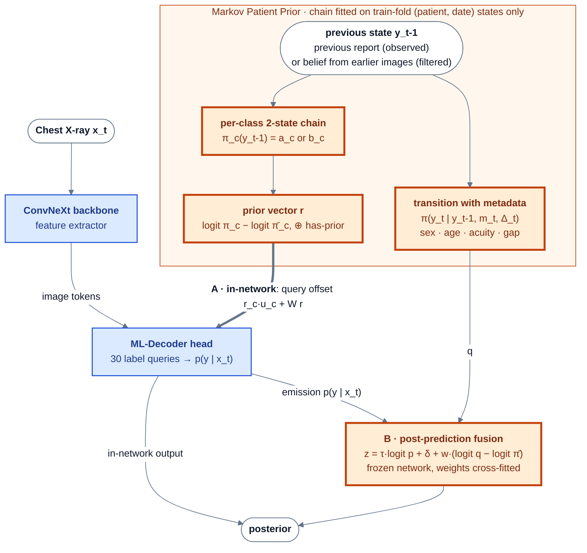
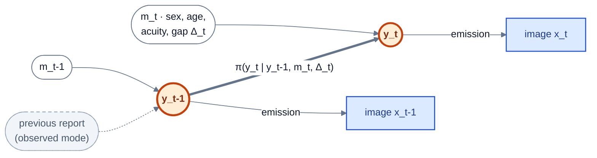
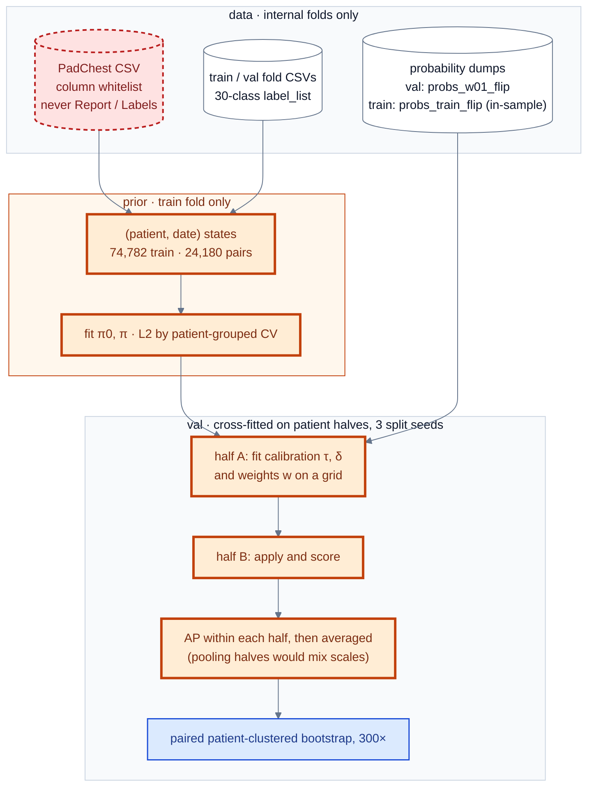

# The Markov Patient Prior: one patient-history chain, two fusion points

*2026-10-02. Replaces the 2026-10-01 version of this note (backup: `markov-layer-architecture.md.pre-patient-prior.bak`), which presented the post-prediction HMM alone and listed v5 as superseded. The papers (`docs/paper/markov/paper.tex`, `docs/paper/isbi/paper.tex`, rev3) present the same architecture.
- Plans: [`2026-10-01-markov-hmm-redesign-plan.md`](2026-10-01-markov-hmm-redesign-plan.md), [`2026-09-30-markov-ab-training-plan.md`](2026-09-30-markov-ab-training-plan.md).
- Results: [`../result/2026-10-01-markov-ab-training.md`](../result/2026-10-01-markov-ab-training.md) (in-network), [`2026-10-01-markov-hmm-posthoc.md`](2026-10-01-markov-hmm-posthoc.md) (post-prediction), [`2026-10-01-markov-ab-verdict.md`](2026-10-01-markov-ab-verdict.md) (comparison), [`2026-10-01-padchest-metadata-eda.md`](2026-10-01-padchest-metadata-eda.md) (metadata).*

**TL;DR**

- **The Markov step runs over a patient's studies, not over the label graph.** Each (patient, date) is a state y_t ∈ {0,1}^30, read from that date's reports. A per-class two-state chain, fitted on 24,180 consecutive training-fold state pairs, gives π_c(y_t-1): the probability of finding c given whether it was present at the previous state.
- **The ConvNeXt is only the feature extractor.** Patient identity is used only to find the earlier state; history and metadata enter after feature extraction, never before the backbone.
- **One prior, two fusion points:**
  - **in-network** (v5, `train/prior_conditioning.py`): the prior vector r offsets the 30 ML-Decoder label queries;
  - **post-prediction** (patient HMM, `analysis/markov_hmm.py`): the frozen classifier's p(y | x) is the emission, the chain (plus gap and metadata) is the transition, and the two are fused after the network.
- **Results (internal validation, previous report available):**
  - in-network, single 768 px model: SWA mAP 0.4600 → 0.4807 (seed 42), 0.4582 → 0.4786 (seed 1024), almost all of it on the 5,759 images with an earlier study;
  - post-prediction H4: +0.038 on frontal images with an earlier study (seed 42), +0.042 (seed 1024); the simplest arm H1 is best;
  - the two fusion points are equivalent within noise (paired H4 − in-network on that subset: +0.002 [−0.016, +0.020]).
- **The gain needs the previous report.** With history inferred from earlier images only (H4-F), it falls to +0.009. With the prior withheld it is 0 (in-network: 0.4624 vs 0.4650).
- **Leaderboard effect: 0 by construction.** CXR-LT test patients have no history, and their metadata may not be linked ([§7](#7-scope)). Never quote 0.48 as a test result or compare it with the 0.4722 no-history ensemble.
- **Label-graph Markov priors do not help** (post-hoc smoothing −0.0006 to −0.0053; Normal-gating −0.010 to −0.046). They are kept only as the negative contrast.

---

## 0. The big picture



- Blue boxes are the v3 network (entropy-gated triplet Stage 2, no MoE). Orange boxes are the Markov Patient Prior.
- Use **one** fusion point at a time: A retrains the network with the prior; B leaves the network frozen.
- With no earlier state, r = 0 (A) and the fusion weights act on the initial prior only or not at all (B), so the output falls back to the classifier.

---

## 1. The prior

- **States** (`analysis/patient_prior.py`, `date_states`): one per (patient, date); y_t is the OR of the label sets of that day's studies. Labels come only from the fold CSVs, in shard order.
- **Chain** (`fit_chain`): for each class c, from consecutive training-fold states of the same patient,
  a_c = P(y_t,c = 1 | y_t-1,c = 1) and b_c = P(y_t,c = 1 | y_t-1,c = 0), with Laplace smoothing; 24,180 pairs.
- **Prior vector** (`lookup_prior`, `prior_log_ratio`): for an image with a strictly earlier state,

$$
r = \big[\operatorname{logit}\pi_c(y_{t-1}) - \operatorname{logit}\bar\pi_c\big]_{c=1}^{30} \oplus 1,\qquad \pi_c(y_{t-1}) = \begin{cases}a_c & y_{t-1,c}=1\\ b_c & y_{t-1,c}=0\end{cases}
$$

  and r = 0 otherwise (π̄ = training prevalence). Written to `analysis/out/patient_markov/priors.pt`.
- **History sources:** training images take their earlier state from the training fold only, so no validation label reaches a training input. Validation images take it from train ∪ val, as in a hospital archive; 5,759 of 17,270 have one (4,061 frontal).

---

## 2. Fusion point A: in-network (v5)

*`train/prior_conditioning.py` (`PriorQueryConditioner`, `ConvNeXt2Prior`), `train/train_2_v5.py`, launcher `scripts/submit_stage2_v5_prior.sh`.*

$$
Q_c \leftarrow Q_c + r_c\,u_c + W r,\qquad u \in \mathbb{R}^{30\times 768},\ W \in \mathbb{R}^{768\times 31}\ \text{(no bias, both zero-initialised)}
$$

- The offset is added to the 30 ML-Decoder label queries **before** they cross-attend to the image. At initialisation the model is exactly v3, and an image without a prior always gets a zero offset.
- **Training:** the v3 768 px push recipe (drop-path 0.1, 4 of 8 cosine epochs, effective batch 48, SWA of the last 3 EMA epochs, entropy-gated triplet loss unchanged), prior dropout 0.3, conditioner lr ×10. Jobs 49375 (seed 42) and 49376 (seed 1024); matched baselines 49000 and 48999.
- **Evaluation:** `evaluate/evaluate_tta_v5.py`, with the prior (`--prior-mode with`) and with every prior set to zero (`--prior-mode zero`; *withheld*, the test condition). `--prior-file` and `--markov-steps` are mutually exclusive in `train_2_v5.py`.

**Results** (flip TTA, SWA, scored on the whole fold, since no weight is fitted on validation; `analysis/out/markov_ab/run.log`):

| Seed | Model | all | earlier study | frontal, earlier | none |
|---|---|---|---|---|---|
| 42 | v3 | 0.4650 | 0.4894 | 0.4909 | 0.4529 |
| | + prior | **0.4839** | **0.5276** | **0.5179** | **0.4562** |
| | withheld | 0.4624 | 0.4811 | 0.4783 | 0.4562 |
| 1024 | v3 | 0.4626 | 0.4807 | 0.4791 | 0.4534 |
| | + prior | **0.4820** | **0.5265** | **0.5171** | **0.4548** |
| | withheld | 0.4663 | 0.4830 | 0.4838 | 0.4548 |

- Training-log SWA (no TTA): 0.4600 → 0.4807 and 0.4582 → 0.4786.
- Paired Δ on frontal images with an earlier study: +0.0270 [+0.0081, +0.0497] (s42), +0.0380 [+0.0265, +0.0547] (s1024).
- Withheld vs v3, all images: −0.0026 [−0.0109, +0.0075] (s42), +0.0037 [−0.0029, +0.0106] (s1024).
- Two-seed flip ensemble: 0.4867 with the prior, 0.4693 withheld.
- Head / medium / tail on frontal images with an earlier study (s42): +0.0175 (3/3), +0.0360 (20/20), +0.0055 (5/7).

---

## 3. Fusion point B: post-prediction patient HMM

*`analysis/markov_hmm.py`, `analysis/markov_hmm_check.py`, `analysis/patient_meta.py`. The classifier is frozen; its probabilities are the emission.*

### 3.1 Graphical model



- **State:** one per (patient, date). y_t ∈ {0,1}^30 is the OR of the labels of that day's studies, exactly as in `patient_prior.date_states`.
- **Joint distribution:** p(y_1:T, x_1:T) = p(y_1 | m_1) · Π_t>1 p(y_t | y_t-1, m_t) · Π_t p(x_t | y_t).

### 3.2 Equations (`analysis/markov_hmm.py`)

$$
\ell_c(x) = \tau\,\operatorname{logit} p_c(x) + \delta_c - \operatorname{logit}\bar\pi_c \qquad\text{(emission as a likelihood ratio; }\bar\pi = \text{train prevalence)}
$$

$$
\operatorname{logit}\pi^0_c(m) = \alpha^0_c + \gamma^{0\top}_c\phi(m),\qquad
\operatorname{logit}\pi_c(y', m, \Delta) = \alpha_c + \beta_c y'_c + \kappa_c y'_c g + \lambda_c g + \sum_{k\neq c} B_{ck} y'_k + \gamma_c^\top\phi(m)
$$

$$
z_c = \tau\,\operatorname{logit} p_c(x) + \delta_c + w\,\big[\operatorname{logit} q_c - \operatorname{logit}\bar\pi_c\big],\qquad
(q, w) = \begin{cases}(\pi(y_{t-1}, m_t, \Delta_t),\ w_h) & \text{earlier state}\\ (\pi^0(m_t),\ w_0) & \text{otherwise}\end{cases}
$$

- **Inputs to the prior:**
  - g = log(1 + gap days).
  - φ(m) = [sex = M, sex unknown, a restricted cubic spline of age (3 terms), acuity = AP, acuity = AP horizontal], standardised (`patient_meta.Featurizer`).
- **Fitting the prior:**
  - All 30 per-class logistic models are fitted at once as one batched float64 torch model, with L-BFGS and L2 (`fit_logistic`).
  - The penalties are chosen by patient-grouped 5-fold CV log-loss on train pairs.
  - The intercept and own-state terms are not penalised.
- **The weights:**
  - w = 1 is Bayes' rule.
  - w_h and w_0 are cross-fitted, because ASL probabilities are not calibrated posteriors and the image and the report share evidence (a device is visible *and* reported).

### 3.3 History modes

| Mode | Where y_t-1 comes from | Prediction step |
|---|---|---|
| **observed** | the previous state's report labels (0/1) | exact: q = π(y_t-1, m_t, Δ_t) |
| **filtered** | a factorised belief μ from a forward pass over all earlier states' images | q_c = μ_c σ(η_c(1, μ)) + (1 − μ_c) σ(η_c(0, μ)); then μ_t = σ(logit q + w_e · mean ℓ(images of date t)) |

- The filtered prediction is exact when B = 0; with cross-class edges it is mean-field (Boyen–Koller projection).
- **Check:** filtered mode with one-hot beliefs reproduces observed mode exactly (asserted).
- **Target date:** only the target image itself enters at the current date. Same-date sibling views are not fused, because that would be an unrelated multi-view gain.

### 3.4 Arms (pre-specified; the primary arm is H4)

| Arm | Adds |
|---|---|
| E | the emission only |
| H0 | pooled 2-state chain (a_c = P(1\|1), b_c = P(1\|0), Laplace), w_h = 1, no calibration. its prior is exactly the chain of [§1](#1-the-prior); **reproduces B-late exactly (asserted)** |
| H1 | + calibration + cross-fitted w_h |
| H2 | + gap terms κ, λ |
| H3 | + metadata φ in the transition and initial prior (w_0 then also moves rows without history) |
| **H4** | + cross-class temporal edges B (`B[k → c]`) |
| H5 | + within-state label–label MRF edges J (pseudo-likelihood Ising, damped mean field, weight w_J): an ablation |
| H4-acq | + per-state DICOM acquisition fields in φ (care-setting proxies): an ablation |
| H4-F | H4 in filtered mode |

### 3.5 Fitting and evaluation flow



- **Data rules** (`analysis/patient_meta.py`):
  - The CSV is read only through a column whitelist. The loader asserts that Report, Labels, Localizations, the CUIs and similar columns are never read.
  - Only fold images are joined. No dev/test image is ever joined.
  - Labels come only from the fold CSVs, in shard order.
  - PatientBirth and sex are allowed for the internal folds (user decision, 2026-10-01).
- **Leakage guard:** the prior parameters never see val labels. Val *history* uses train ∪ val studies, as for the in-network prior, so the two fusion points are comparable.
- **Estimator gotcha:** halves fitted with different calibrations must not be pooled into one ranking. Pooling once produced spurious losses of 0.006–0.03. The check is a recalibration-only arm, which must give Δ = 0.

---

## 4. Results: post-prediction (with the in-network rows for comparison)

- **Source:** canonical run, job 49445 (`analysis/out/markov_hmm/run.log`, `results.json`).
- **Numbers:** Δ vs the emission E, as the patient-clustered bootstrap mean with 95% CI (300 resamples, split seed 0). Every mAP is computed within each patient half and averaged over 3 split seeds.
- **Subsets:** primary = val images with an earlier state that are frontal (n = 4,061); full = 17,270; no-prior = 11,511.
- **Point estimates:** H2 and H5 have no bootstrap.
- **Full write-up:** [`2026-10-01-markov-hmm-posthoc.md`](2026-10-01-markov-hmm-posthoc.md).

| Emission | Arm | full | **primary** | no-prior |
|---|---|---|---|---|
| **s42** | E (absolute mAP) | 0.4652 | 0.5020 | 0.4543 |
| | H0 | +0.009 [−0.003, +0.024] | +0.035 [+0.015, +0.058] | +0.000 [+0.000, +0.000] |
| | H1 | +0.022 [+0.014, +0.035] | +0.048 [+0.030, +0.066] | +0.000 [−0.000, +0.000] |
| | H2 | +0.020 (point) | +0.046 (point) | +0.000 (point) |
| | H3 | +0.016 [+0.009, +0.024] | +0.038 [+0.023, +0.052] | −0.001 [−0.002, −0.000] |
| | **H4** | +0.015 [+0.009, +0.023] | +0.038 [+0.023, +0.051] | −0.001 [−0.002, −0.000] |
| | H5 | +0.016 (point) | +0.039 (point) | −0.000 (point) |
| | H4-acq | +0.017 [+0.011, +0.025] | +0.038 [+0.023, +0.052] | −0.000 [−0.003, +0.002] |
| | H4-F | +0.003 [−0.002, +0.008] | +0.009 [−0.001, +0.018] | −0.001 [−0.002, −0.000] |
| | In-network (A) | +0.019 [+0.013, +0.026] | +0.034 [+0.015, +0.055] | +0.001 [−0.005, +0.013] |
| | In-network, withheld | −0.003 [−0.009, +0.005] | −0.007 [−0.020, +0.001] | +0.001 [−0.005, +0.013] |
| **s1024** | E (absolute mAP) | 0.4635 | 0.4937 | 0.4551 |
| | H0 | +0.011 [−0.000, +0.027] | +0.043 [+0.022, +0.067] | +0.000 [+0.000, +0.000] |
| | H1 | +0.026 [+0.017, +0.040] | +0.053 [+0.035, +0.075] | +0.000 [−0.000, +0.000] |
| | H2 | +0.020 (point) | +0.052 (point) | +0.000 (point) |
| | H3 | +0.017 [+0.010, +0.025] | +0.043 [+0.029, +0.061] | −0.000 [−0.001, +0.001] |
| | **H4** | +0.016 [+0.009, +0.025] | +0.042 [+0.028, +0.059] | −0.000 [−0.001, +0.001] |
| | H5 | +0.017 (point) | +0.046 (point) | −0.000 (point) |
| | H4-acq | +0.018 [+0.012, +0.025] | +0.043 [+0.029, +0.060] | +0.001 [−0.002, +0.005] |
| | In-network (A) | +0.019 [+0.011, +0.025] | +0.044 [+0.025, +0.063] | +0.000 [−0.006, +0.006] |
| | In-network, withheld | +0.000 [−0.004, +0.005] | −0.000 [−0.007, +0.009] | +0.000 [−0.006, +0.006] |
| **ens** | E (absolute mAP) | 0.4737 | 0.5100 | 0.4635 |
| | H0 | +0.003 [−0.008, +0.017] | +0.030 [+0.010, +0.052] | +0.000 [+0.000, +0.000] |
| | H1 | +0.020 [+0.012, +0.034] | +0.045 [+0.027, +0.063] | −0.000 [−0.000, +0.000] |
| | H2 | +0.019 (point) | +0.044 (point) | −0.000 (point) |
| | H3 | +0.015 [+0.009, +0.024] | +0.039 [+0.023, +0.056] | −0.000 [−0.000, +0.000] |
| | **H4** | +0.013 [+0.007, +0.022] | +0.036 [+0.021, +0.052] | −0.001 [−0.002, +0.000] |
| | H5 | +0.015 (point) | +0.039 (point) | −0.001 (point) |
| | H4-acq | +0.014 [+0.007, +0.023] | +0.036 [+0.021, +0.054] | +0.001 [−0.004, +0.004] |

**Decision rule (pre-specified):**
- **Win: met.**
  - H4 beats E on the primary subset at both seeds: +0.038 [+0.023, +0.051] (s42) and +0.042 [+0.028, +0.059] (s1024).
- **Matches the in-network prior: met.** Paired H4 − in-network at the matched seed:

  | Subset | s42 | s1024 |
  |---|---|---|
  | primary | +0.002 [−0.016, +0.020] | −0.002 [−0.020, +0.016] |
  | full | −0.004 [−0.011, +0.005] | −0.002 [−0.010, +0.006] |

  The post-prediction model equals the network that was retrained with the prior, without touching the network.
- **Guards:**
  - No-prior rows: s42 is −0.0009 [−0.0018, −0.0001]. That is tiny, but the CI is just below 0, because w_0 = 0.25 was chosen in one fold. s1024 passes.
  - New-finding stratum AP ("new vs absent", 28 classes): it falls slightly at both seeds, 0.368 → 0.362 (s42) and 0.365 → 0.362 (s1024), with no CI.

**What the ladder says:**
- **Simplest is best.** H1 (pooled chain + calibration + fitted w_h ≈ 0.5–0.75) beats H4 by about 0.01 everywhere. The exploratory H1 − in-network on the primary subset is +0.012 [−0.008, +0.035] (s42) and +0.008 [−0.013, +0.029] (s1024).
- **A better prior does not mean a better fusion.** Gap, metadata and cross-class edges make the prior a much better *predictor* of the next study without the image. On held-out train pairs, the macro log-loss goes 0.151 → 0.145 → 0.138 → 0.137, and the macro AUROC 0.662 → 0.765 → 0.803 → 0.813. They still lower the fused mAP, because what they add (acuity → devices, age → aortic change) is already visible in the image. The [EDA](2026-10-01-padchest-metadata-eda.md) shows the same thing directly.
- **Within-state MRF edges (H5) are never used.**
  - w_J = 0 was chosen in every fold, so H5 = H4.
  - This happens even though the pseudo-likelihood couplings are strong (Normal ~ pleural effusion −1.51; Support Devices ~ central venous catheter +1.46).
  - The ML-Decoder already models within-image label dependence.
- **Acquisition fields (H4-acq)** are ≈ H4.

**Filtered mode (image-only history, H4-F, s42):**
- The gain drops:

  | Subset | Filtered H4-F | Observed H4 |
  |---|---|---|
  | primary | +0.009 [−0.001, +0.018] | +0.038 |
  | has-prior | +0.013 [+0.007, +0.020] | — |

- **Clean subset** (whole history in val, so every history emission is out-of-sample; n = 248):

  | Mode | Δ |
  |---|---|
  | filtered | +0.004 [−0.010, +0.019] |
  | observed H4 | +0.032 [+0.003, +0.060] |

- **This is despite an optimistic setup.** Train-image emissions are in-sample (train-fold mAP 0.713 vs about 0.465 on val), which should flatter filtered mode.
- **Conclusion:** most of the longitudinal gain needs the previous **report**, not the previous image. Report-derived labels make part of that "reporting habit" rather than disease persistence.
- **Positive side:** filtered mode does not copy. New-finding stratum AP rises slightly, 0.368 → 0.369.

**Reproducibility:**
- An earlier observed-only run (job 49424, a different CPU node) gives identical H0/H1.
- The logistic-prior arms differ by ≤ 0.0014 mAP. L-BFGS rounding across nodes sometimes flips a tied grid weight.
- No conclusion changes.

---

## 5. Choosing the fusion point

1. **They give the same gain.** Paired H4 − in-network on frontal images with an earlier study is +0.002 [−0.016, +0.020] (s42) and −0.002 [−0.020, +0.016] (s1024). Neither is better.
2. **Post-prediction (B) is the practical default.**
   - It needs no retraining: the leaderboard checkpoint and the longitudinal model are the same weights.
   - The prior enters through a few interpretable parameters per class and one or two weights, so it cannot learn to copy the previous report the way a network can (Zhu et al., arXiv 2306.08749). Its behaviour on new findings is measured directly (§4, new-finding stratum).
   - It can use metadata in the transition; in-network (A) uses none.
3. **In-network (A)** costs a full Stage-2 retrain per seed and reads the history inside the network. With the prior withheld it is within noise of v3, so the same checkpoint also serves the no-history case.
4. **Metadata only belong in the transition.** Stacking sex, age, view or acquisition fields onto the image logit lowers mAP by 0.003 to 0.016 ([EDA](2026-10-01-padchest-metadata-eda.md)); they help only where the image cannot see them, in how findings evolve between studies.
5. **Never before the ConvNeXt.** Feeding history or metadata into the image encoder mixes non-image evidence into the features, needs history at test time, and reintroduces the copy risk.

---

## 6. Code map

| What | Where |
|---|---|
| Batched per-class logistic regression (L-BFGS, L2, own-state features, masks) | `analysis/markov_hmm.py:48` |
| `PriorSpec` (table / logistic, gap, meta, cross) | `analysis/markov_hmm.py:100` |
| `PriorModel.fit` / `initial_logit` / `predict` (exact or mean-field) / observed logits | `analysis/markov_hmm.py:157` / `:176` / `:180` / `:196` |
| Emission calibration `fit_calibration` / `calibrate` | `analysis/markov_hmm.py:222` / `:241` |
| Within-state MRF: `fit_pairwise` (pseudo-likelihood) / `meanfield` | `analysis/markov_hmm.py:246` / `:270` |
| `forward_filter` (observed / filtered history) | `analysis/markov_hmm.py:281` |
| `FusionWeights`, `fuse` | `analysis/markov_hmm.py:306` / `:313` |
| `MarkovHMM` (apply / save / load; fitted models in `analysis/out/markov_hmm/model_H4_*.pt`) | `analysis/markov_hmm.py:324` |
| Whitelisted metadata reader, fold join | `analysis/patient_meta.py:39` / `:48` |
| (patient, date) states with sex / age / acuity / previous index / gap | `analysis/patient_meta.py:82` |
| Previous-state lookup (strictly earlier) | `analysis/patient_meta.py:112` |
| Acquisition features (H4-acq) | `analysis/patient_meta.py:132` |
| φ(m) featuriser (RCS age spline) | `analysis/patient_meta.py:165` |
| Runner: priors, train-CV diagnostics, arms, cross-fitting, per-half AP, bootstrap, comparators | `analysis/markov_hmm_check.py:142` (`run_arm` `:397`, `cf_map` `:453`, `evaluate` `:462`) |
| Reused: fold loading, study table, date states, pooled chain, prior lookup | `analysis/patient_prior.py:66` / `:84` / `:97` / `:105` / `:120` |
| Metadata EDA (screen, multivariate, transitions, incremental value, figures) | `analysis/metadata_eda.py` |
| In-network prior: `PriorQueryConditioner`, `ConvNeXt2Prior`, `load_model_for_state_dict` | `train/prior_conditioning.py` |
| In-network training (`--prior-file`, `--prior-dropout`, `--prior-lr-mult`) | `train/train_2_v5.py`, `scripts/submit_stage2_v5_prior.sh` |
| Chain + per-image prior vectors → `priors.pt` | `analysis/patient_prior.py` |
| In-network vs v3 per-subset comparison | `analysis/markov_ab_compare.py` |
| Probability dumps with keys, with / withheld prior (any classifier) | `evaluate/evaluate_tta_v5.py` |

Run it:

```bash
srun -c 8 --mem=64G -p general --time=10:00:00 .venv/bin/python analysis/markov_hmm_check.py   # → analysis/out/markov_hmm/
.venv/bin/python analysis/metadata_eda.py --figures-only                                        # redraw EDA figures
```

---

## 7. Scope

- **Leaderboard: 0 by construction.**
  - CXR-LT 2026 test patients are de-duplicated against training.
  - Patient IDs and metadata are not released.
  - The PadChest CSV holds the evaluation images' labels and reports, so dev/test must never be joined to it.
- **What the results are.** Every number here is an internal-val **longitudinal simulation**.
  - The val fold is not patient-disjoint.
  - Labels are report-derived, so "observed history" partly measures reporting habit (see §4, filtered mode).
- **Where the leaderboard model comes from.** For Task 1, use the v3 checkpoints. With no history, post-prediction fusion returns the classifier's ranking unchanged, and the in-network model with its prior withheld is within noise of v3.
- **How to quote it.** Every number for the prior needs "previous report available" next to it, plus the withheld result. Do not compare the in-network 0.4807 (single model, with history) with the 0.4722 ensemble (no history).

---

## Appendix — retired: v4 label-graph Markov layer

*Not part of the architecture. Kept only because its checkpoints and result docs exist.*
- A trainable label → label layer after the logits (`train/markov_layer.py`, `train/train_2_v4.py`, jobs 49063–49065, 49377). It did not beat v3 (SWA −0.003 to −0.005, gates ≈ 0): one global label matrix adds nothing to the ML-Decoder's per-image label mixing. Write-ups: [`../result/2026-09-27-v4-markov-result.md`](../result/2026-09-27-v4-markov-result.md), [`../result/2026-10-01-markov-ab-training.md`](../result/2026-10-01-markov-ab-training.md).
- `train/markov_layer.py` stays in the repo: `train_2_v5.py` and `prior_conditioning.py` import helpers from it.
- Evaluate v4 checkpoints only with `evaluate/evaluate_tta_v4.py` or `evaluate_tta_v5.py`; `evaluate_tta.py` silently drops `label_refine.*`.

## Sources

- `docs/pdf/ISBI2026.pdf`: §2.2 model architecture; §2.4–2.5 two-stage training, MoE, ASL; Table 3 (test mAP 0.4599).
- `docs/pdf/Entropy.pdf`: slide 3 (label co-occurrence, imbalance); slides 5–7 (triplet cross-memory bank).
- CXR-LT 2026 challenge paper, arXiv 2604.15555, pp. 4–5: test de-duplication and data-use rules.
- Zhu et al., arXiv 2306.08749: input-level conditioning on prior reports copies the prior.
